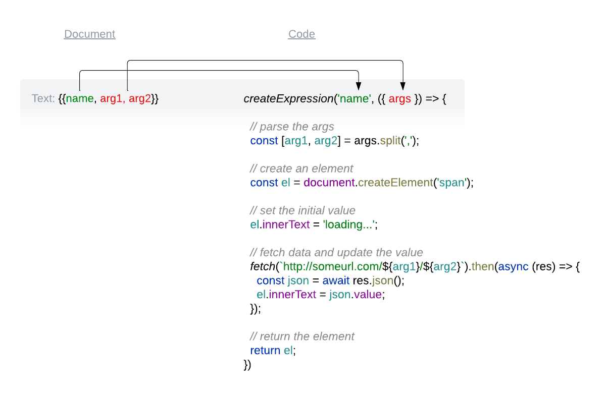

# Franklin Expressions
> Turn documents into dynamic templates with expressions.

Expressions allow users to transform Franklin documents into templates by adding simple expressions with parameters.
These expressions then become HTML elements that display dynamically fetched content.
It is also possible to use expressions as decorators to style and augment content around the insertion point. 
This turns expressions into reusable fragments that can be placed inside top level Franklin blocks.



## When is this is useful?
- I want to show the value of a market asset using its ticker.
- I want to show a product's price by its SKU and plan.
- I want to style links based on their type (like CTA).
- I want to group and style inline items, like an image with a title and link.
- I want to use composition and nesting inside Franklin blocks.

## Features
- Allows to insert dynamically computed values into Franklin documents.
- Allows to decorate content around the insertion point.
- Tiny with no external dependencies.

## Usage
- Copy `expressions.js` to your project's `scripts` directory
- Create an expression by calling `createExpression` with a name and a function returning a string or an element.
- Render expressions by calling `renderExpressions` in your block's or card's `decorate` function.

## Examples

### Basic expression

The code below computes the sum of two numbers:

```js
createExpression('sum', ({ args }) => {
  
  // get the numbers from the args
  const [a, b] = args.split(',');

  // compute the sum and return it as a string
  return `${parseInt(a) + parseInt(b)}`;
});
```

### Dynamic price by SKU and plan

The code below fetches the price of a product by its SKU and plan and renders it as a span:

```js
async function fetchProductDetails() {
  return new Promise((resolve) => {
    const price = Math.floor(Math.random() * (955 - 195 + 1) + 195) / 100;
    setTimeout(() => resolve(price), 300);
  });
}

createExpression('price', ({ args }) => {
  
  // get the sku and plan from the args
  const [sku, plan] = args.split(',');

  // create a span to hold the price
  const el = document.createElement('span');

  // fetch the price
  fetchProductDetails(sku, plan)
    .then((price) => {
      el.innerText = `$${price}`;
    });

  // crete a value placeholder for the price (CLS friendly)
  el.innerText = 'loading...';

  return el;
});
```

### Call-to-action button with popup

The following code decorates a link as a CTA button that triggers a popup:

```js
createExpression('cta', ({ parent, args }) => {

  // get the first sibling that is a link
  const a = parent.nextElementSibling.querySelector('a');
  if (a === null) return;

  // get the first argument
  const [popup] = args.split(',');

  // style the link
  a.style.backgroundColor = 'red';

  if (popup) {
    // add a click handler
    a.addEventListener('click', (e) => {
      alert('I am an alert box!');
      e.preventDefault();
    });
  }
});
```

| Document                                   | HTML                                                     |
|--------------------------------------------|----------------------------------------------------------|
|  |  |

## Links

- [Live demo](https://main--franklin-expressions-website--vtsaplin.hlx.page/)
- [Demo project](https://github.com/vtsaplin/franklin-expressions-website)
