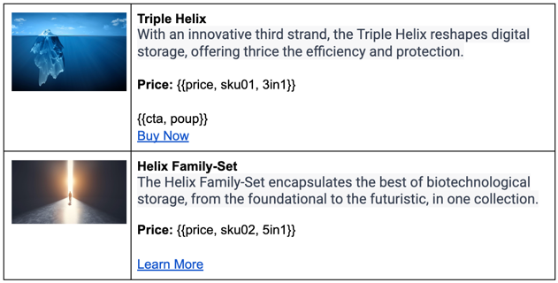

# Franklin Nanoblocks
> Nanoblocks let you add placeholders and decorators to Franklin documents.

## When this is useful
- I want to show the value of a market asset using its ticker.
- I want to show a product's price by its SKU and plan.
- I want to style links based on their type (like CTA).
- I want to group and style inline items, like an image with a title and link.
- I want to use composition and nesting inside Franklin blocks.

## Features
- Allows to insert placeholders and inline decorators into Franklin documents.
- Allows to use composition and nesting inside Franklin blocks.
- Tiny with no external dependencies.

## Installation
- Copy `nanoblocks.js` to your project's `scripts` directory

## Usage
- Create a nanoblock by calling `createNanoBlock` function with a name and a function that returns a string or a DOM element.
- Render nanoblocks by calling `renderNanoBlocks` in your block's `decorate` function.

## Examples

### Dynamic price by SKU and plan

The code below fetches the price of a product by its SKU and plan and renders it as a span:

```js
async function fetchProductDetails() {
  return new Promise((resolve) => {
    const price = Math.floor(Math.random() * (955 - 195 + 1) + 195) / 100;
    setTimeout(() => resolve(price), 300);
  });
}

createNanoBlock('price', ({ args }) => {
  // get the sku and plan from the args
  const [sku, plan] = args.split(',');

  // create a span to hold the price
  const el = document.createElement('span');

  // fetch the price
  fetchProductDetails(sku, plan).then((price) => {
    el.innerText = `$${price}`;
  });

  // crete a value placeholder for the price (CLS friendly)
  el.innerText = 'loading...';

  return el;
});
```

### Call-to-action button with popup

The following code decorates a link as a CTA button that triggers a popup:
```js
createNanoBlock('cta', ({ parent, args }) => {
  
  // get the first sibling that is a link
  const a = parent.nextElementSibling.querySelector('a');
  if (a === null) return;
  
  // get the first argument
  const [popup] = args.split(',');
  
  // style the link
  a.style.backgroundColor = 'red';

  if (popup) {
    // add a click handler
    a.addEventListener('click', (e) => {
      alert('I am an alert box!');
      e.preventDefault();
    });
  }
});
```

| Document                                   | HTML                                                     |
|--------------------------------------------|----------------------------------------------------------|
|  |  |
